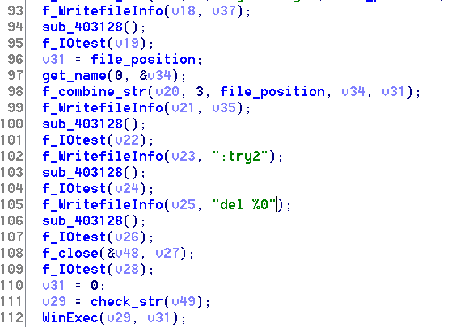
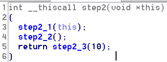
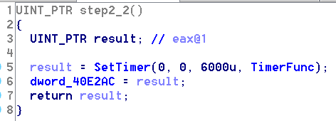

#熊猫烧香病毒逆向过程与分析记录

#####By TTX

##0x1前言

熊猫烧香病毒是2007年肆虐互联网的著名病毒之一，在当时的互联网环境下，大多数用户都使用Windows XP系统，与现在的Windows 10不同的是，XP系统的权限管理，安全措施都做的不到位，导致恶意程序可以轻易获取管理员权限，从而对整个系统进行破坏。

但是，熊猫烧香病毒已经无法影响Windows 10系统，那么分析这个10年前的老病毒的意义是什么呢？目前工业上很多软件仍然未得到及时更新，很多工业系统的内部仍然使用着XP系统。另外一点，对于笔者而言，由于是第一次进行病毒分析，如果直接对最新版的勒索病毒进行分析未免显得捉襟见肘，因此拿这个10年前的结构简单的经典病毒进行下手，进行学习和分析。

如今，网络上有很多对这种经典病毒的行为解析，而且已经分析的比较透彻，因此这里笔者将会从自己的病毒反汇编分析的思路展示熊猫烧香病毒行为的过程。

##0x2工具及环境

- Ollydbg
- IDA
- Win7

##0x3病毒样本

##0x4病毒行为
首先使用OllyDbg打开病毒样本，得到病毒开始执行的地址为0x40d0a0

使用IDA打开病毒样本，发现0x40d0a0即为start函数地址，使用F5进行反编译分析，如下

从执行位置开始，首先，病毒会对两个字符串"xboy","whboy"进行加密，将加密后的字符串和密文进行对比，如果比较错误，则退出程序。

在逆向这些函数的时候，我首先比较在意的是if()判断函数，发现函数里面变量没有具体的赋值位置，因此又看了汇编代码部分，感觉是类似于字符串比较函数strcmp()的功能，结合Ollydbg动态调试，发现确实如此。因此一一倒退推理出之前几个函数的意义。

如图，比较的地址为0x1BC000C 与 0x1BC00C0，一致

在字符串比较正确之后，病毒继续执行，将分成三部分执行。

(此处由于事前不知道具体功能，暂时命名为3个步骤)

####4.1第一部分行为分析
跟进第一部分，病毒最先做的是删除目录下的"./Desktop_.ini"文件

Desktop_.ini是系统可识别的一个文件，作用是存储用户对文件夹的个性设置（用户更换文件夹图标等等），这个文件本身是没有危害的，但病毒可以利用这个文件的机制将自己的属性设置为系统,隐藏等，让用户无法看见或者修改它等。

然后病毒关闭进程spcolsv.exe，将自己命名为spcolsv.exe，放在~/system32/driver/目录下，用WinExec函数进行运行，结束自身。

那么病毒本体到这里就结束运行了，但是它的复制体~/system32/driver/spcolsv.exe已经开始跑起来了。
因此前面必然进行了一道判断，用来区分是伪造体还是病毒本体，从而进行下一段的分析。

在这一部分的逆向中笔者遇到了比较大的困难，很多函数的意图难以分析，因此首先把一些显而易见的函数先进行分析，然后再结合猜测+验证的模式，逐步进行解析。事实上，这一步首先会判断是否是病毒本身，然后根据路径信息判断是否是病毒的伪造体，再执行下一步代码

被验证为伪造体后，又存在另一个检测：

这个检测实际上是区分执行进程是伪造体还是感染文件的，如果是伪造体则直接跳过，执行后面的代码，而如果是感染文件，则会做以下事情：

- 还原被感染的可执行文件

- 把病毒拷贝到~/system32/driver/目录下

- 命名为spcolsv.exe并执行

伪造体和感染文件都会做：

- 构造自删除批处理脚本并执行
	- 内容为删除可执行文件,重命名为加密文件名

在这逆向的过程中，有更多的函数和更复杂的处理，因此跳过了很多意义不明的函数，到后面逆向了大部分后，参考了网上的分析，回头看才分析出来。

####4.2 第二部分行为分析
打开第二部分函数，可以看到其又细分为三步，逐步进行分析。

#####第一步：伪造体创建了一个线程，对本地文件进行感染

首先检测白名单，即不感染的文件列表

总结一下，白名单目录有：
	
WINDOW，Winnt，System Volume Information，Recycled，Windows NT，Windows Update，Windows Media Player，Outlook Express，Internet Explorer，NetMeeting，Common Files，ComPlus Applications，Messenger，InstallShield Installation Information，MSN，Microsoft Frontpage，Movie Maker，MSN Gamin Zone

如果目标文件不是白名单文件，则对创建一个"Destop.ini"文件,(此处估计为修改图标为熊猫烧香)

对文件进行检查，如果后缀为exe,pif,com,src，则将自己附加到文件头部，同时将文件按指定格式命名，通过判断命名时间和系统时间对比，不重复感染已经感染过的文件

对文件进行检查，如果后缀为html,html,asp,php,jsp,aspx，则将解密一段加密过后的网址写入对应的网站

此处笔者没有对解密进行详细分析，估计病毒的本意是为网址增加点击量或者其它用途

#####第二步：创建计时器，感染磁盘文件

当笔者逆向到这一步时，结合前面对许多函数的分析后，这一步的分析比较快速和准确。

跟踪进入TimeFunc，可以发现进程会在磁盘的根目录下生成:

1.setup.exe

2.autorun.inf，如果已经有autorun.inf则会比较是否是对应脚本内容，如果不是则重新写入，并利用AutoRun Open关联使病毒在用户点击被感染磁盘时能被自动运行

#####第三步：网络传播

跟入第三步，发现病毒生成一个线程，继续跟进，有：

分析后，当病毒发现能成功联接攻击目标的139或445端口后，将使用内置的一个用户列表及密码字典进行联接（猜测被攻击端的密码）。当成功联接上以后将自己复制过去，并利用计划任务启动激活病毒。

139端口和445端口已经因为漏洞问题于2017年被强制关闭了，但是由这一点我们也可以看出，在当时这个病毒可谓无所不用其极。

####4.3第三部分行为分析

进入病毒行为的第三部分，直接就可以看到SetTimer函数，直接就可以看出病毒设置了四个计时器：分别是1s执行一次，20min执行一次，10s执行一次和6s执行一次

1.跟进计时器1，可以发现其后面做的事情则是添加了注册表：

使病毒伪造体能够自启动

同时在病毒的开始注意到一个函数：跟进发现为创建线程，继续跟进

这部分的行为是使是检测一系列的杀毒软件，注册表，并将其删除，用于保护自身

2.跟进计时器2，发现其创建一个线程，对一段信息进行解密

解密信息自己尚不清楚，但是往后分析发现函数URLDownloadToFileA

推测功能为下载病毒木马指定的文件，并执行，这个文件推测为木马文件，其前面与"QQ"字符串进行比较，推测为QQ木马

3.跟进计时器3，发现其创建两个线程

第一个线程下载木马（与计时器2相同），跟进第二个线程，发现其关闭了网络共享服务

执行指令为：

最后，创建完线程后，又关闭计时器

4.跟进计时器4，可以清楚的看到其对进程的一系列处理：

函数的功能是关闭相关杀毒软件的自启动项

##0x5总结

因此，熊猫烧香的病毒行为可以总结如下：

1.创建伪造进程

- 将病毒自身命名为spcolsv.exe，放在~/system32/driver/目录下执行

2.感染PE文件

- 后缀为exe,pif,com,src，则将病毒自身附加到文件头部，同时将文件按指定格式命名.
- 后缀为html,html,asp,php,jsp,aspx，则将网址附加在文件上，使得直接跳转至指定网址
- 在目录下创建'.Destop.ini'，修改图标为"熊猫烧香"
- 创建自删除批处理脚本，删除未被感染，或者感染过期的文件
 

3.自我保护

- 遍历删除杀毒软件对应的进程名
- 遍历删除杀毒软件对应的注册表名，防止杀毒软件自启动
- 关闭网络共享
- 创建自启动注册表
- 在磁盘的根目录下生成setup.exe,autorun.inf利用AutoRun Open关联使病毒在用户点击被感染磁盘时能被自动运行

4.网络传播

- 利用弱密码从139，445端口连接登陆，下载木马并传播

##0x6病毒防御

如果已经被病毒感染，根据病毒分析过程，可以通过以下方式进行防御：

1) 关闭spcolsv.exe进程，然后可以删除spcolsv.exe文件了。

2) 关闭媒体自动播放，防止autorun启动病毒

3) 将磁盘根目录的隐藏文件删除

4) 对于其他被感染的文件，由于病毒并没有破坏源文件，因此可以还原原来的被感染文件

##0x7后记

通过这次病毒分析，可见病毒行为之恶劣，可谓无所不用其极。但是这并不意味着病毒容易传播，只要我们平时注意防范，不要轻易运行不可信的程序，或者浏览恶意的网站，病毒就难以入侵。

这次逆向分析的过程，充满挑战和趣味。挑战在于很多陌生的函数，陌生的处理不明白，在逆向的过程中曾一度面临崩溃，因为过多的函数处理使得难以找到逻辑突破口，因此这是一个极度考验耐心和观察力的过程。但是逆向完之后，就越发觉得这个过程充满了趣味。

虽然这个病毒已经被分析透彻，但是，对于笔者而言，学习和理解了很多新的知识和技巧。同时，也进一步提升了笔者的安全意识。

##0x8参考
https://www.52pojie.cn/thread-713505-1-1.html
https://baike.baidu.com/item/%E7%86%8A%E7%8C%AB%E7%83%A7%E9%A6%99/11050605?fr=aladdin